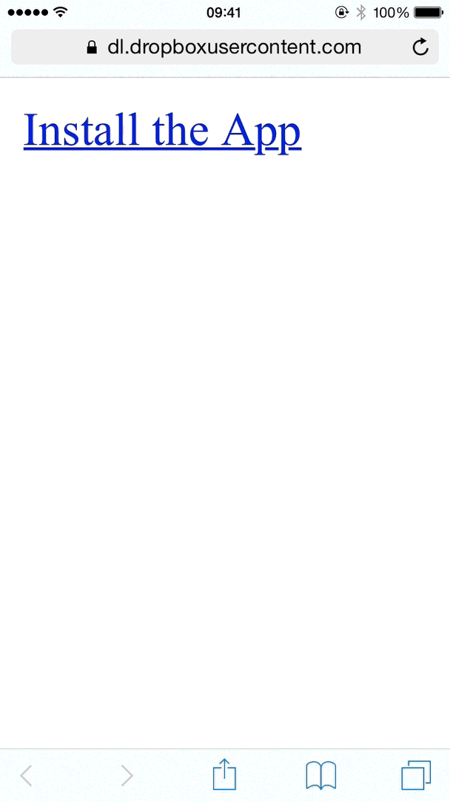
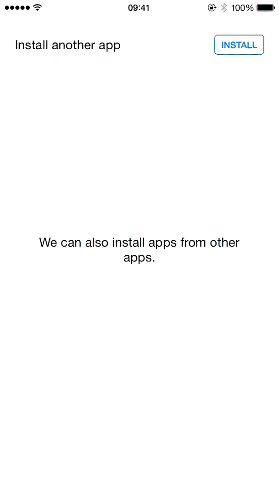
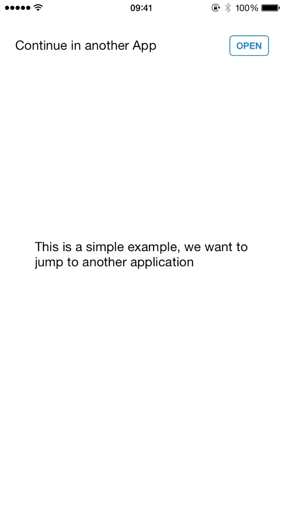

# Trespassing in the wilderness of the iOS SDK

At Testlio we work with some internal iOS apps, all of which need to be available for installation within the organisation.

In this post, we'll take a look at how this process can be simplified. I’ll provide an awesome, yet familiar experience from the App Store.

I should note that this post won't cover provisioning profiles, [as fun as they might be](https://twitter.com/KrauseFx/status/631126390197354496) or the [device management](http://www.apple.com/iphone/business/it/management.html) aspects of iOS.

Also, I want to preface this post with a disclaimer: most of this post is not necessarily _safe_ for the App Store, but where would the world be without the _crazy ones_?

## The Over-the-Air (OTA) approach

Once upon a time, sharing Ad Hoc or Enterprise builds of an app meant having to send the person an IPA file, have them open iTunes(!), and manually sync the application over to their device.

You can still do that to this day. However, in a world of untethered backups, cloud computing, and [easily breaking iOS cables](http://www.quora.com/Why-do-Apples-proprietary-cables-break-so-often-or-so-easily), this gets tedious.

Luckily, since iOS 4.0, Apple has allowed what they call over-the-air distribution, where applications can be installed by pointing the device to an appropriate manifest property list file.

There have been some minor changes to this approach, such as Xcode first generating the manifest file and then dropping that support, or the requirement of hosting the manifest and application on SSL-enabled servers. However, the process underlying mechanism for the approach has remained largely the same.

It is worth noting that with services like Dropbox or Google Drive, handling this sort of distribution is a breeze. You only need a way to send the user a suitable link, which uses the **itms-services** URL scheme.



## The OTA-in-an-app approach

This is where most people would stop. Simply hosting a simple webpage with one or many installable applications on it. Then updating the IPAs and manifests as new versions come out and so on.

But what if we felt adventurous and we wanted to install an application from within another application, how would we do this? A simple usecase for this would be cross-referencing between different tools without forcing the user to return to our web-based app gallery.

An initial implementation may look a bit like this:

```swift
let manifestURL = // itms-services URL, as used on the web
if UIApplication.sharedApplication.canOpenURL(manifestURL) {
    UIApplication.sharedApplication.openURL(manifestURL)
} else {
    // Show some error as our plan was foiled
}
```



It works exactly like it does on the web! Perfect!

Now we have something much more inline, prompting the user to install the target application right within the workflow. There is one case we still need to handle: if the user already has the app, wouldn’t it be nice to then open the app instead of installing it?

But how exactly do we detect the presence of an application?

We could have a set of [URL schemes](https://developer.apple.com/library/ios/documentation/iPhone/Conceptual/iPhoneOSProgrammingGuide/Inter-AppCommunication/Inter-AppCommunication.html#//apple_ref/doc/uid/TP40007072-CH6-SW1) in place, however, keeping inline with our post, how would that be any fun? And what if the only thing we knew about the other app is its bundle identifier?

## Stepping into the dark side

iOS developers enjoy the bliss of working with APIs carefully designed by engineers at Apple.

Yet it is important to understand that iOS, as any other platform, is much more than what is visible in the SDK. If iOS is _the Force_, then we are generally _Jedi_. What if, for a moment, we didn't limit ourselves like this and had a look over to the _dark side_ - the private APIs of iOS?

Contrary to what the name suggests, the private APIs are actually not that private, there's a handful of repositories and methods online for obtaining them such as [class-dump](http://stevenygard.com/projects/class-dump/) or [class-dump-z](https://code.google.com/p/networkpx/wiki/class_dump_z). For the rest of this post, the headers we are working will originate from [this repository by Nicolas Seriot](https://github.com/nst/iOS-Runtime-Headers).

Roughly 23,000 classes to go through - talk about a haystack! As a sidenote, this really puts [the 18,000+ classes in Facebook's app](http://quellish.tumblr.com/post/126712999812/how-on-earth-the-facebook-ios-application-is-so) into perspective.

Sadly, there’s hardly any documentation for private APIs, which makes our lives more difficult. But, after some investigating and trying different search terms across the headers, we can narrow our search down to [MobileCoreServices.framework](https://github.com/nst/iOS-Runtime-Headers/tree/master/Frameworks/MobileCoreServices.framework) and the following two private classes - `LSApplicationWorkspace`, `LSApplicationProxy`

These two classes conceptually represent an arbitrary application and the workspace/home screen of the device.

Unsurprisingly, these classes contain methods to check if an application is installed, as well as opening an app by its bundle identifier. This means we can include the private headers in our project and write some code like this:

```swift
let bundleIdentifier = "com.testlio.example.bundle"
if let workspace = LSApplicationWorkspace.defaultWorkspace() as? LSApplicationWorkspace,
       application = workspace.allInstalledApplications().filter({ $0.applicationIdentifier == bundleIdentifier }).first {
    // We have the application, let's open it
    workspace.openApplicationWithBundleID(bundleIdentifier)
} else {
    // Install the app like we did before
}
```

## Going even deeper

While spelunking through the private headers, a keen eye may spot additional interesting methods and properties that could be integrated into our little experiment.

With some work, we can end up with something that detects if the app is installed or install it if necessary, and finally open the application - all while showing a nice progress indicator to the end-user.

Deep-linking on steroids.



You can find the final example application on [GitHub](https://github.com/Testlio/ios-installation-blog-example). It utilises the concepts discussed throughout this post. It offers two modes of execution: one for applications that are likely already installed (such as the Settings app), while the other is for applications that are based on a manifest.

Once again, keep in mind that this is experimental and should be treated as such.

## Takeaway

While building applications for the App Store has its perks, it is important to realise what possibilities lie outside of its beautiful and fertile grasslands.

Conducting experiments and thinking outside of the box is not only a good way to take a break, but it also helps us appreciate the importance of tooling and documentation we use on a daily basis. It is also important to emphasise that not all apps are destined for the App Store and it is okay to take chances on apps that we build for ourselves.

I think it is refreshing to see the full capabilities of the devices and the operating system we use, even if it will never see the light of day on the App Store. If nothing else, it helps us build better tools for ourselves. In turn, this helps us build better apps for everyone else.

Just imagine what you could build when you had access to frameworks such as [AssistantServices](https://github.com/nst/iOS-Runtime-Headers/tree/master/PrivateFrameworks/AssistantServices.framework), [CarKit](https://github.com/nst/iOS-Runtime-Headers/tree/master/PrivateFrameworks/CarKit.framework) or [XPCKit](https://github.com/nst/iOS-Runtime-Headers/tree/master/PrivateFrameworks/XPCKit.framework).

_Whether you enjoy the occasional walk on the dark side or simply [#lovetesting](https://twitter.com/testlio), make sure to check out our [jobs page](https://testlio.com/jobs)_
